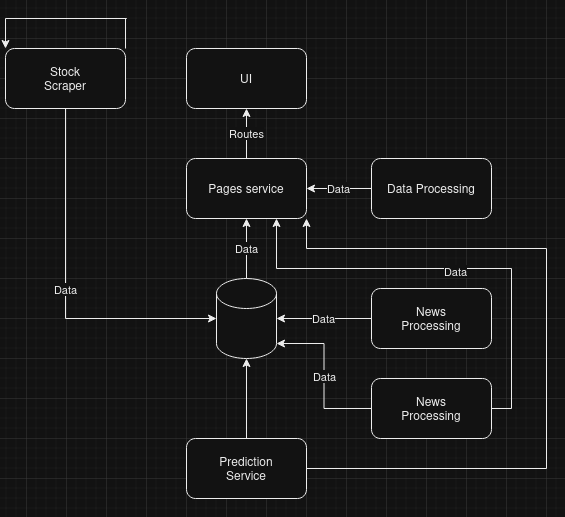
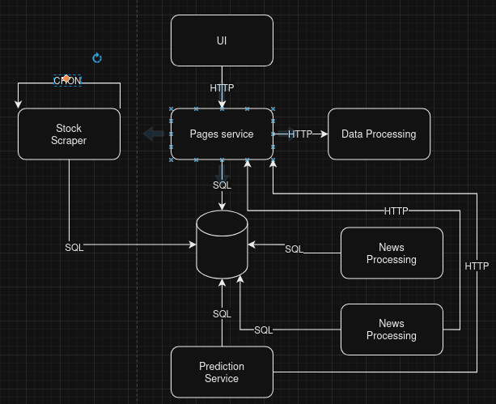
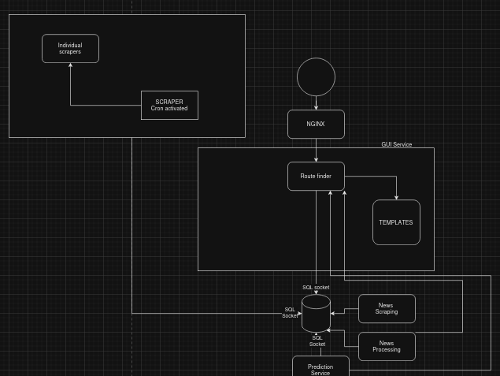

#### Conceptual Architecture

The system can be divided into the following major components:

1. **Scraping Service (Stock Data)**: Responsible for scraping stock data from a website. It uses the `gocolly` library and operates on multiple threads for performance. It retrieves company details and trading history, cleans the data, and stores it in a database.

2. **Frontend Service (User Interface)**: This is a web server (using `gofiber`) that listens for incoming HTTP requests. It serves templates based on routes and interacts with other services.

3. **Data Calculation Service (Analytics)**: Computes financial indicators like moving averages and relative strength over time. It calls the database and returns simplified analytics data. It uses the `go-ma` and `go-rsi` libraries.

4. **Article Scraping Service**: Scrapes articles related to a company and stores them in a database. This service uses `gocolly` for scraping.

5. **Sentiment Analysis Service**: Processes article data to determine whether the article has a positive or negative impact on the company’s stock. This service uses `Ollama` (preferably a lighter model) for sentiment analysis.

6. **Prediction Service**: A machine learning service written in Python, likely using Long-Short Term Memory (LSTM) networks for stock price predictions based on historical data. This service will run as a Flask API and will return predictions on stock performance.

7. **Database**: A central storage system (SQL or NoSQL) that stores historical stock data, articles, sentiment results, and prediction outputs.

---

#### Implementational Architecture

1. **Scraping Service (Stock Data)**:
   - **Technology**: Go (`gocolly` library, multithreading)
   - **Communication**: Communicates with the Database service for storing the scraped data.
   - **Database**: Uses a connection pool to save the data in batches.

2. **Frontend Service (User Interface)**:
   - **Technology**: Go (`gofiber` for web framework)
   - **Communication**: Interacts with various backend services to request analytics, sentiment, and predictions.
   - **Route Handling**: Dynamically serves different templates and handles different routes for stock data, sentiment, and predictions.

3. **Data Calculation Service**:
   - **Technology**: Go (`go-ma` for moving averages, `go-rsi` for relative strength index)
   - **Communication**: Queries the database for historical stock data and sends processed data back to the frontend service.

4. **Article Scraping Service**:
   - **Technology**: Go (`gocolly` for web scraping)
   - **Communication**: Scrapes news articles and sends them to the database.

5. **Sentiment Analysis Service**:
   - **Technology**: Go (`Ollama` API for sentiment analysis, `gofiber` for interservice communication)
   - **Communication**: Sends article content to the sentiment analysis model, stores the results in the database, and communicates with the frontend.

6. **Prediction Service**:
   - **Technology**: Python (Flask, TensorFlow/Keras for LSTM models)
   - **Communication**: Flask API serves prediction requests from the frontend and other services.

7. **Database**:
   - **Technology**: SQL or NoSQL database (depending on the data model)
   - **Communication**: Each service interacts with the database for reading and writing data.

---

#### Functional Architecture

1. **Data Scraping**:
   - The `Scraping Service` scrapes stock data in a multithreaded manner and stores it in the database.

2. **User Interface**:
   - The `Frontend Service` handles user requests, determines which service to interact with, and returns the appropriate data (historical data, predictions, sentiment analysis) to the client.

3. **Data Calculation**:
   - The `Data Calculation Service` processes the stock history and calculates metrics like moving averages and RSI based on the provided date range.

4. **Article Scraping**:
   - The `Article Scraping Service` scrapes news articles about a company and stores them in the database for further processing.

5. **Sentiment Analysis**:
   - The `Sentiment Analysis Service` processes articles to determine sentiment (positive or negative) and stores the results in the database.

6. **Prediction**:
   - The `Prediction Service` analyzes historical stock data using LSTM models and returns a prediction on whether the stock price will increase or decrease.

5. **Sentiment Analysis Service**: Processes article data to determine whether the article has a positive or negative impact on the company’s stock. This service uses `Ollama` (preferably a lighter model) for sentiment analysis.

6. **Prediction Service**: A machine learning service written in Python, likely using Long-Short Term Memory (LSTM) networks for stock price predictions based on historical data. This service will run as a Flask API and will return predictions on stock performance.

7. **Database**: A central storage system (SQL or NoSQL) that stores historical stock data, articles, sentiment results, and prediction outputs.

---
